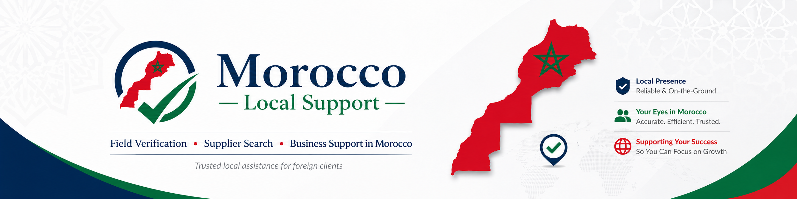

# Morocco Local Support

Reliable on-the-ground assistance in Morocco for foreign clients, businesses, buyers, travelers and entrepreneurs.

Morocco Local Support helps clients access trusted local information, practical coordination and structured support before making decisions in Morocco.

## What We Do

We provide local support services in Morocco, including:

- Field verification and address checks
- Supplier search and product price comparison
- Market research and competitor checks
- Business visit planning and local coordination
- Calls, follow-ups and communication with Moroccan contacts
- Local representative support
- Field photos/videos when allowed
- Structured local reports
- Custom legal and ethical local tasks in Morocco

## Who We Help

We support:

- Foreign buyers
- Entrepreneurs
- Small businesses
- Import/export professionals
- Travelers and visitors
- Investors exploring Morocco
- Companies looking for local information

## Our Approach

Our work is based on:

- Clarity
- Reliability
- Practical execution
- Ethical local support
- Respect for privacy
- Structured reporting

## Important Notice

Morocco Local Support does not provide private investigation, spying, bribery, confidential data collection, illegal surveillance, or any activity that violates local laws or privacy.

All services are handled legally, ethically and professionally.

## Official Links

Website: https://moroccolocal.support  
LinkedIn: add your LinkedIn company page link here  
Fiverr: add your Fiverr gig/profile link here  
Facebook: add your Facebook page link here  

## Contact

For local support requests in Morocco, please contact us through our official website or professional pages.
